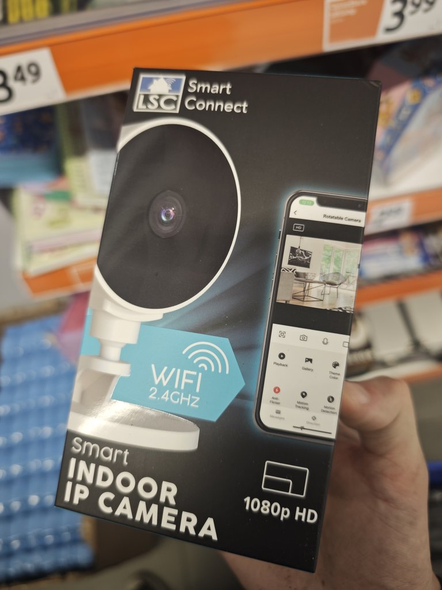
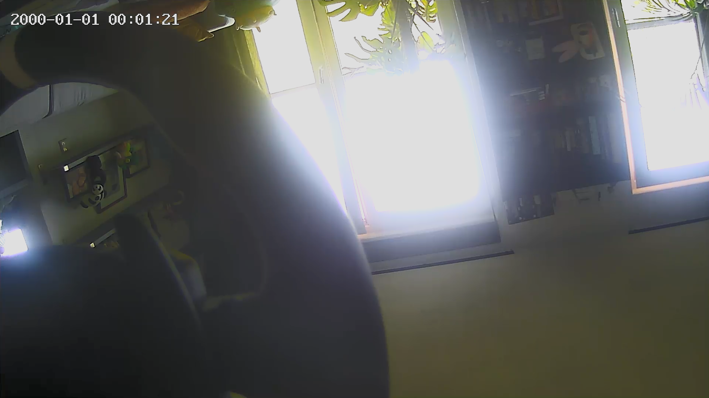
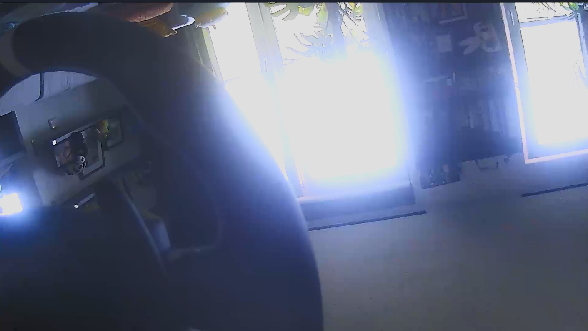
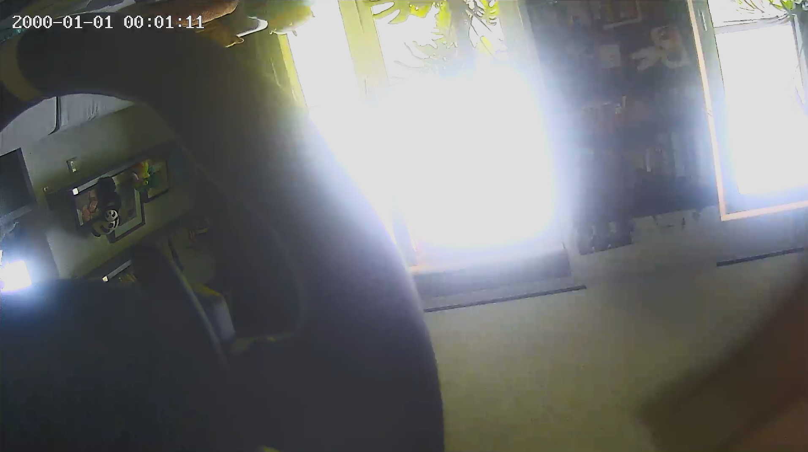
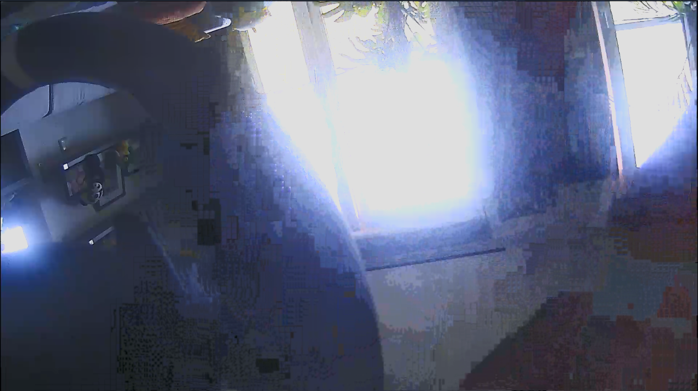

# LSC Smart Connect Indoor IP Camera (AK3918AV130) Custom Firmware

[](LICENSE)
[]()
[]()
[]()

A standalone, 100% cloud-free custom firmware and native RTSP server for the **LSC Smart Connect Smart Indoor IP Camera 1080p HD** (Action SKU `SI B26101`, model `3215672.2`).

This project completely removes the proprietary Tuya cloud agent (`anyka_ipc`) and replaces it with a lightweight, reverse-engineered C application (`ak_rtsp`) that streams pristine 1080p H.264 video and synchronized audio directly to your local network (Home Assistant, Synology Surveillance Station, Frigate, go2rtc, VLC).

---



---

## ⚠️ Important Disclaimer & Risks

> ⚠️ **CAUTION: FLASHING AND MODIFYING THIS DEVICE IS STRICTLY AT YOUR OWN RISK.**
>
> - **Experimental Codebase:** This is the public release of a much larger private reverse-engineering project. The reverse engineering itself — reading UART logs, decompiling `anyka_ipc` in Ghidra, strace-capturing the stock RTSP session, cross-referencing ioctl structs, etc. — was done by hand over many sessions. This public repository (its structure, docs, and some cleanup/refactoring) was then compiled and organized with AI assistance from that original project. While core streaming and hardware drivers have been verified on test units, the codebase has **not been exhaustively tested by hand across all conditions or manufacturing batches** and carries inherent experimental risks.
> - **Risk of Permanent Hardware Bricking:** Writing to the SPI NOR flash chip carries a real risk of permanently bricking your camera. In the worst case, a corrupted flash may result in an unrecoverable hard brick that can only be fixed by physically desoldering the flash chip and using an external SPI programmer (e.g. CH341A).
> - **No Liability:** The authors and contributors of this repository accept **zero liability or responsibility** for damaged hardware, bricked cameras, data loss, or voided warranties.
> - **Windows + WSL only.** Every tool, script, and workflow in this repo (the .NET serial console, the `zig cc` cross-build, the WSL `mksquashfs` packaging step) has only ever been developed and tested on Windows 11 with WSL/Ubuntu. Native Linux or macOS hosts, other WSL distros, or other cross-compilers may well work, but they are **completely untested** — you're on your own figuring out any path/tooling differences if you go that route.
> - **Always make a complete flash backup** before attempting to flash any custom image.
> - **Always double-check the flash verification logs** before disconnecting power.
> - If flashing fails or reports errors, **DO NOT power cycle**—attempt to flash your stock backup immediately!

---

## Key Features

- **100% Cloud-Free (De-Tuyafied):** Tuya cloud daemons, MQTT beacons, and telemetry binaries are completely eliminated.
- **Native SmolRTSP Streaming Engine:** Lightweight standalone C server (`ak_rtsp`, ~126 KB) built on [OpenIPC's SmolRTSP](https://github.com/OpenIPC/smolrtsp) library, interfacing directly with the Anyka hardware ISP and H.264 encoder.
- **1080p High-Quality Video:** Full 1920x1080 resolution at 15–25 FPS with calibrated ISP parameters (color correction matrix, white balance gains, noise reduction, and VBR+ rate control).
- **Synchronized Audio:** Captures from on-board microphone via `/dev/pcmC0D0c` streamed over RTP (L16 / 8000 Hz) with RTCP Sender Reports for jitter-free playback in VLC and NVRs.
- **IR-Cut & Night Mode:** Dual GPIO solenoid pulse control for daytime IR-cut filtration and night vision illumination.
- **Hardened MTD Flasher (`flash_tool`):** Chunked 4KB write/verify/retry flasher that avoids the SPI-NOR DMA corruption bugs common when writing flash over active network/camera drivers.
- **Hardware Toolkit:** Includes an automated ESP32 U-Boot interceptor bridge and a high-performance Windows .NET 9 WinUI serial console.

---

## 📷 Current Status & Image Quality

> ℹ️ **Image Quality Notice:**  
> The custom firmware is fully functional and stable for continuous 24/7 streaming. However, **the dynamic image tuning (contrast, wide-dynamic range curves, and auto-exposure adjustments) is still somewhat behind the stock Tuya firmware's proprietary closed-source tuning**.  
> We have calibrated the static white balance gains (`R=460, G=256, B=504`) to fix the raw sensor blue tint and tuned VBR+ rate control to minimize macroblocking, but there is ample room for future community improvement and tuning of the 24-module Anyka ISP pipeline! Pull requests and ISP tuning experiments are very welcome.

| | Stock Tuya (`anyka_ipc`) | This Firmware (`ak_rtsp`) |
|---|:---:|:---:|
| **Static scene** |  |  |
| **Motion** |  |  |

### Known Limitations

- **No dynamic auto white balance (AWB).** White balance uses fixed, hand-calibrated gains
  (see above) rather than tracking scene color temperature dynamically. In practice, the stock
  Tuya firmware doesn't appear to do dynamic AWB either in the scenes tested so far, so this may
  not be a real functional gap — but it's worth knowing if your lighting varies a lot.
- **Two-way audio (speaker output) is not supported.** Microphone capture → RTP streaming
  (camera-to-viewer audio) is fully working, but the reverse direction (playback through the
  camera's on-board speaker, e.g. for NVR "talk" features) is not implemented. Out of scope for
  now — may be revisited in the future.

---

## Hardware Overview

| Component | Specification |
|---|---|
| **Retail Model** | LSC Smart Connect Smart Indoor IP Camera 1080p HD (Action) |
| **Model / SKU** | `3215672.2` / `SI B26101` |
| **PCB Revision** | `IPC280KG2-GNA-MAIN-V1.0` (Circular PCB, 2025-08-28) |
| **SoC** | Anyka AK3918AV130 (ARM926EJ-S @ 400 MHz) |
| **Image Sensor** | GalaxyCore GC20C3 (2MP 1/2.9" CMOS, I2C bus) |
| **Flash Memory** | 8 MiB SPI NOR (`XM25QH64D` / Winbond SOIC-8) |
| **Wireless** | Altobeam ATBM6012BX / ATBM6x3x USB WiFi |
| **Power** | USB-C 5V / 1A |

> ℹ️ **NOTE:** This repository is tailored for **Revision 2** (circular PCB, Anyka AK3918AV130). Older revisions with rectangular boards used different SoCs (AK3918EV200 or GK7102) which have different register maps and flash partitioning.

---

## Step 0: MANDATORY — Dump Your Stock Firmware Backup!

Before doing anything else, connect to your camera shell (via UART or Telnet) and create a full backup of all 8 flash partitions:

```sh
# 1. Mount SD card and create backup directory
mount -t vfat /dev/mmcblk0p1 /mnt
mkdir -p /mnt/original_firmware

# 2. Dump all partitions
dd if=/dev/mtdblock0 of=/mnt/original_firmware/mtdblock0.bin bs=64k
dd if=/dev/mtdblock1 of=/mnt/original_firmware/mtdblock1.bin bs=64k
dd if=/dev/mtdblock2 of=/mnt/original_firmware/mtdblock2.bin bs=64k
dd if=/dev/mtdblock3 of=/mnt/original_firmware/mtdblock3.bin bs=64k
dd if=/dev/mtdblock4 of=/mnt/original_firmware/mtdblock4.bin bs=64k
dd if=/dev/mtdblock5 of=/mnt/original_firmware/mtdblock5.bin bs=64k
dd if=/dev/mtdblock6 of=/mnt/original_firmware/mtdblock6.bin bs=64k
dd if=/dev/mtdblock7 of=/mnt/original_firmware/mtdblock7.bin bs=64k
sync
```

Keep a copy of `/mnt/original_firmware/` safely on your computer!

---

## Quick Installation Guide

### Step 1: Prepare the MicroSD Card
Format a MicroSD card as FAT32 and copy the following files:
- `custom_firmware/ak_rtsp_firmware_YYYYMMDD_HHMMSS.squashfs` (the padded firmware image — see
  [Building Your Own Firmware](docs/building_your_own_firmware.md) for how to produce this)
- `flash_tool` (pre-compiled binary from `src/ak_rtsp/`)
- `tools/flash_scripts/install_with_flash_tool.sh`
- `tools/flash_scripts/restore.sh` *(for safety fallback)*
- `original_firmware/mtdblock*.bin` *(your stock backup)*

### Step 2: Connect & Run Flashing Script
Insert the SD card, connect to the camera over Telnet (or UART), mount the card, and execute:
```sh
mount -t vfat /dev/mmcblk0p1 /mnt
sh /mnt/install_with_flash_tool.sh
```

### Step 3: Check Verification Output!
> 🛑 **IMPORTANT: Always verify the tool output before powering down:**
> ```text
> FAULT SUMMARY: 0/1280 chunks needed retry, 0 total failed verify attempts.
> Flashing and verification completed successfully!
> ```
> If any errors are displayed, **DO NOT DISCONNECT POWER!** Run `sh /mnt/restore.sh` to revert to your stock firmware image first.

### Step 4: Power Cycle by Hand
> ℹ️ **NOTE:** The software `reboot` command **does not work reliably** on this hardware platform.  
> **Unplug and reconnect the USB-C power cable by hand** to power cycle the camera.

---

## RTSP Stream URLs

Once booted into the custom firmware, the camera serves RTSP on standard port 554.

The custom `ak_rtsp` server is **path-agnostic** (it serves the 1080p video + audio stream on any requested path or root `/`):

| Format | RTSP URL Example | Notes |
|---|---|---|
| **Root (Simplest)** | `rtsp://<camera-ip>:554/` | 1920x1080 H.264 + Synchronized L16 Audio |
| **Named Path (Optional)** | `rtsp://<camera-ip>:554/live` or `/main_ch` | Any sub-path works interchangeably |

*(Note: `rtsp://<camera-ip>:554/main_ch` was the legacy path used by the original Tuya firmware, which continues to work seamlessly).*

---

## Repository Structure

```
.
├── docs/                                # Technical Documentation & Guides
│   ├── hardware_and_uart.md             # Disassembly, UART pads, U-Boot shell & photos
│   ├── flash_partition_map_and_rootfs.md# Flash layout, stock boot traps, de-Tuyafication
│   ├── firmware_building_and_flashing.md# Build guide & SPI-NOR DMA contention gotchas
│   ├── camera_and_audio_pipeline.md     # ISP registers, div0 kernel fix, audio capture
│   └── building_your_own_firmware.md    # WSL setup, dump/unsquash/patch/rebuild your own image
├── images/                              # Hardware photographs and diagrams
├── src/
│   └── ak_rtsp/                         # Standalone C RTSP server & flash_tool source
│       ├── Makefile                     # Cross-compilation Makefile (Zig / Anyka GCC)
│       ├── build_firmware.sh            # Patches your own app_extracted/ dump & repacks squashfs
│       ├── main.c                       # System bring-up and orchestration
│       ├── isp.c / isp.h                # GC20C3 134-reg init & 24-module ISP pipeline
│       ├── vi.c / vi.h                  # Video input channels (1080p slice mode)
│       ├── venc.c / venc.h              # H.264 hardware encoder setup (VBR+)
│       ├── rtsp.c / rtsp.h              # RTSP / RTP server & RTCP Sender Reports
│       ├── audio.c / audio.h            # ALSA PCM mic capture & ring buffer
│       ├── ircut.c / ircut.h            # IR-cut solenoid pulse controller
│       ├── ae.c / night.c               # Hardware auto-exposure & day/night switching
│       ├── flash_tool.c                 # Chunked verified MTD SPI-NOR flasher
│       └── arm_atomics.S                # ARMv5TE legacy atomic stubs
└── tools/
    ├── flash_scripts/                   # Deployment and flash management scripts
    │   ├── install_with_flash_tool.sh   # Primary proven Telnet/UART MTD flasher
    │   ├── install_ak_rtsp_firmware.sh  # Bare UART fallback flasher
    │   ├── pad_build.sh                 # SquashFS padding & timestamp naming script
    │   ├── restore.sh                   # Restore stock APP partition
    │   ├── restore_full_firmware.sh     # Restore ALL stock partitions
    │   └── ...
    ├── firmware_patch_templates/        # The actual de-Tuyafication patch (process.ini + wrapper)
    └── hardware_debug/                  # Hardware tools
        ├── lolin32_uart_bridge/         # ESP32 auto U-Boot interception firmware
        └── serial_console_dotnet/       # WinUI 3 serial terminal with base64 transfer
```

---

## Building from Source

### Prerequisite: SmolRTSP
`ak_rtsp` is **not** linked against a prebuilt SmolRTSP library — its `Makefile` compiles
[OpenIPC's SmolRTSP](https://github.com/OpenIPC/smolrtsp) sources directly into the `ak_rtsp`
binary, and expects to find them as a sibling directory: `../smolrtsp` relative to
`src/ak_rtsp/` (i.e. checked out at the repo root, next to `src/`). This is *not* included in
this repository. Before building, clone it and let CMake populate its own header-only
dependencies (`slice99`, `datatype99`, `interface99`, `metalang99`) via FetchContent — you only
need the *configure* step, not a full build:

```bash
git clone https://github.com/OpenIPC/smolrtsp.git
cd smolrtsp
cmake -S . -B build   # populates build/_deps/{slice99,datatype99,interface99,metalang99}-src
```

The resulting `smolrtsp/` tree (with `include/` and the populated `build/_deps/`) is exactly
what `src/ak_rtsp/Makefile`'s include paths expect. This has only been tested against the
SmolRTSP revision available at the time this project was built — if the upstream repo has
since diverged, some source-level adjustments in `src/ak_rtsp/rtsp.c`/`venc.c` may be needed.

### Compiling `ak_rtsp`
You can cross-compile using [Zig](https://ziglang.org/) without needing complex toolchains installed:

```bash
cd src/ak_rtsp
make CC="zig cc -target arm-linux-musleabi -mcpu=arm926ej_s -static"
```

### Compiling `flash_tool`
```bash
cd src/ak_rtsp
zig cc -target arm-linux-musleabi -mcpu=arm926ej_s -static -O2 flash_tool.c -o flash_tool
```

### Running the .NET Serial Console & Tuning Suite
```powershell
cd tools/hardware_debug/serial_console_dotnet
dotnet run -c Release
```

---

## Detailed Documentation

- [Hardware & UART Connection Guide](docs/hardware_and_uart.md)
- [Flash Partition Map & De-Tuyafication Details](docs/flash_partition_map_and_rootfs.md)
- [Firmware Packaging & Flash DMA Gotchas](docs/firmware_building_and_flashing.md)
- [Camera ISP, Audio & Div0 Fix Architecture](docs/camera_and_audio_pipeline.md)
- [Serial Console & Live Camera Tuning App Guide](docs/serial_console_and_camera_tuning.md)
- [Building Your Own Firmware From Your Own Dump](docs/building_your_own_firmware.md)

---

## Methods & Approach

This firmware exists because of a fairly standard embedded-RE toolchain, applied by hand over
many sessions before this repo was compiled:

1. **UART access first.** Solder to the 4 UART pads, capture the boot log, intercept U-Boot's
   autoboot with a scripted Ctrl+C flood, and get a root shell via `init=/bin/sh` bootargs.
2. **strace the stock behavior.** With the vendor's `anyka_ipc` running its factory RTSP demo
   mode, `strace` every ioctl it makes against the ISP/VI/VENC/audio character devices. This is
   the ground truth for every hardware init sequence this project reimplements — reversing from
   a decompiler alone, without a real reference trace of a known-working session, would have
   been far slower and less reliable.
3. **Decompile in Ghidra.** Where the strace log alone doesn't explain a struct layout or ioctl
   semantics (e.g. why a particular field has to be non-zero), decompile the relevant function
   in `anyka_ipc` or a kernel module to confirm it directly.
4. **Reimplement from scratch, verify against the trace.** `ak_rtsp` doesn't call into any
   vendor `.so` — it drives the same character devices directly, with ioctl sequences derived
   from steps 2–3, and its output is repeatedly checked byte-for-byte against captures of the
   stock session (see `docs/camera_and_audio_pipeline.md`) whenever behavior diverged.
5. **De-Tuyafy at the application layer.** Rather than replacing the kernel or rootfs, only the
   APP partition's process list is patched to launch `ak_rtsp` instead of the vendor's Tuya
   cloud client — see `docs/flash_partition_map_and_rootfs.md`.

## Credits & Acknowledgements

- **Anyka Community & Researchers:** Inspiration and reference implementations from [VGerris's Anyka Hacking Journey](https://github.com/VGerris/Anyka_ak3918_hacking_journey) and [Lawliet95's ANYKA Tuya Journey](https://github.com/Lawliet95/ANYKA-Tuya-Hacking-Journey-AK3918v200EN080-v200). Both cover earlier-generation Anyka SoCs (`AK3918EV200`/`GK7102`) with different register maps and flash layouts than this Revision 2 (`AK3918AV130`) hardware, but were valuable for general ioctl naming conventions and orientation.
- **SmolRTSP (OpenIPC):** High-performance, lightweight RTSP library for embedded systems by [OpenIPC/smolrtsp](https://github.com/OpenIPC/smolrtsp).
