# Hardware & UART Access

This guide documents the physical hardware, disassembly, and UART serial console access for the **LSC Smart Connect Smart Indoor IP Camera 1080p HD**.

---

## 1. Target Device


*Retail packaging: LSC Smart Connect Indoor IP Camera 1080p (Model 3215672.2 / SKU SI B26101).*

This camera is an affordable indoor pan/tilt IP camera sold under the LSC Smart Connect brand at Action stores.

| Front (on stand) | Back (on stand) | Back (capsule removed) |
|:---:|:---:|:---:|
| 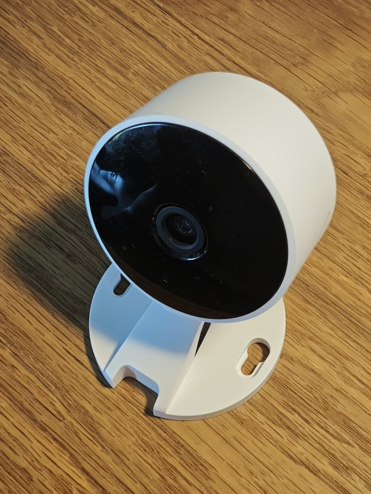 | 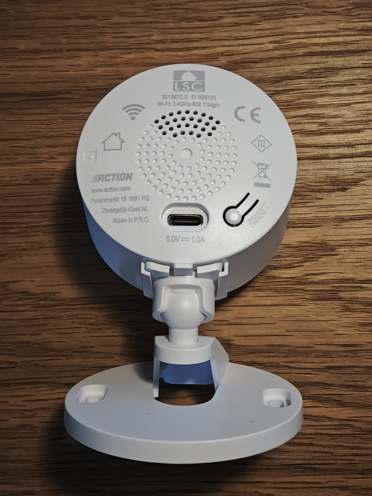 | 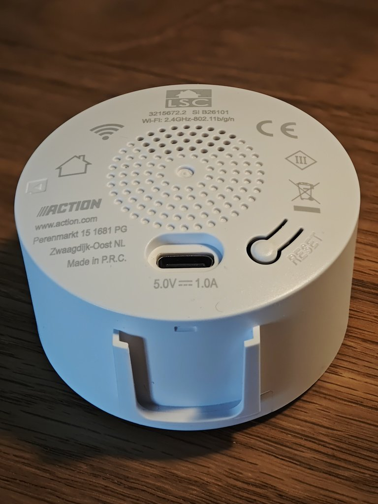 |
| *Fully assembled camera.* | *Speaker grille, USB-C port, reset button, product labels.* | *Model info, USB-C port, and reset button on the removed capsule.* |

> ℹ️ **NOTE (Revision Notice):** This project specifically targets **Revision 2** featuring the circular PCB and the **Anyka AK3918AV130** SoC. Older LSC camera revisions used the Anyka AK3918EV200 or Goke GK7102/GK7202 SoCs with rectangular PCBs and different flash layouts.

### Specifications
- **SoC:** Anyka AK3918AV130 (ARM926EJ-S core)
- **Image Sensor:** GalaxyCore GC20C3 (2MP 1080p, I2C bus)
- **SPI NOR Flash:** XM25QH64D / Winbond 8 MiB (SOIC-8)
- **WiFi:** Altobeam ATBM6012BX / ATBM6x3x USB WiFi
- **PCB Revision:** `IPC280KG2-GNA-MAIN-V1.0` (dated 2025-08-28)
- **Power:** USB-C 5V


*Anyka AK3918AV130 SoC block diagram.*

---

## 2. Hardware Overview

| PCB Back | PCB Front |
|:---:|:---:|
| 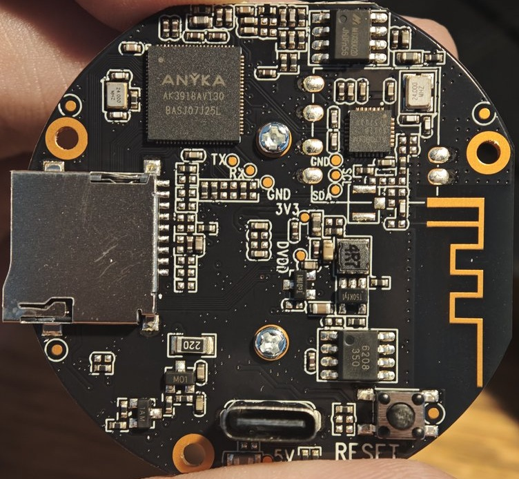 | 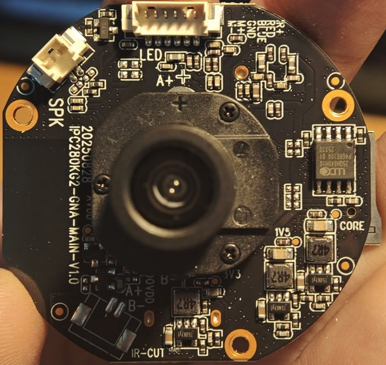 |
| *SoC (centre), MicroSD slot, USB-C port, reset switch, UART test pads.* | *Lens assembly, IR-CUT solenoid connector, status LED, SPI NOR chip.* |

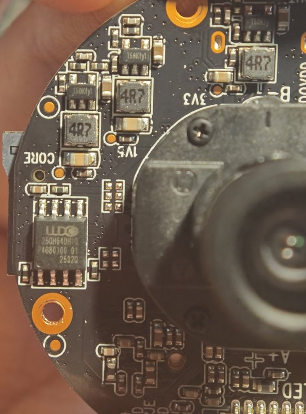
*Close-up of the 8 MiB SPI NOR flash (XM25QH64D).*

---

## 3. Disassembly Guide

The camera housing clips together securely. Prying the front bezel directly from the outside can scratch or damage the plastic. Use the following non-destructive technique:

1. Detach the camera body from its mounting base.
2. Drill a ~6 mm hole into the bottom of the white outer shell. Drill only through the plastic layer to avoid hitting internal wires or the PCB. (The hole remains completely hidden once remounted).
3. Insert a long, thin screwdriver through the hole and gently push against the back of the front faceplate until the clips release.
4. Unclip the internal faceplate PCB and set it aside.
5. Unclip the other connector (for the speaker behind the main pcb).
6. From here the main pcb can easily be unscrewed and removed.

| Drill Hole | Push Faceplate |
|:---:|:---:|
| 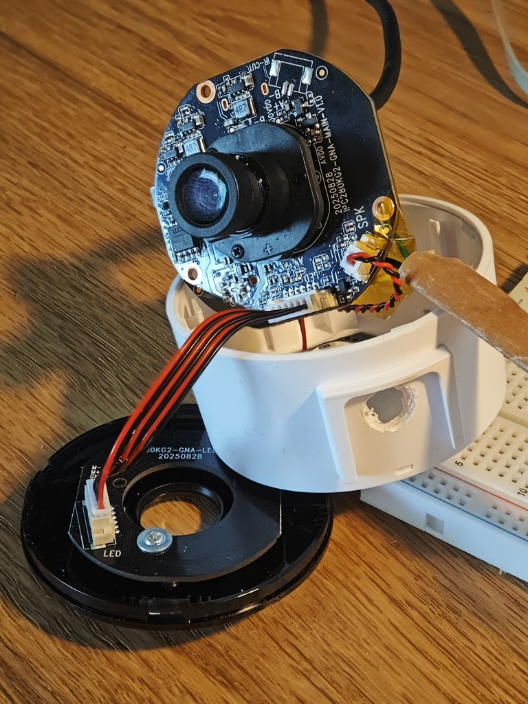 | 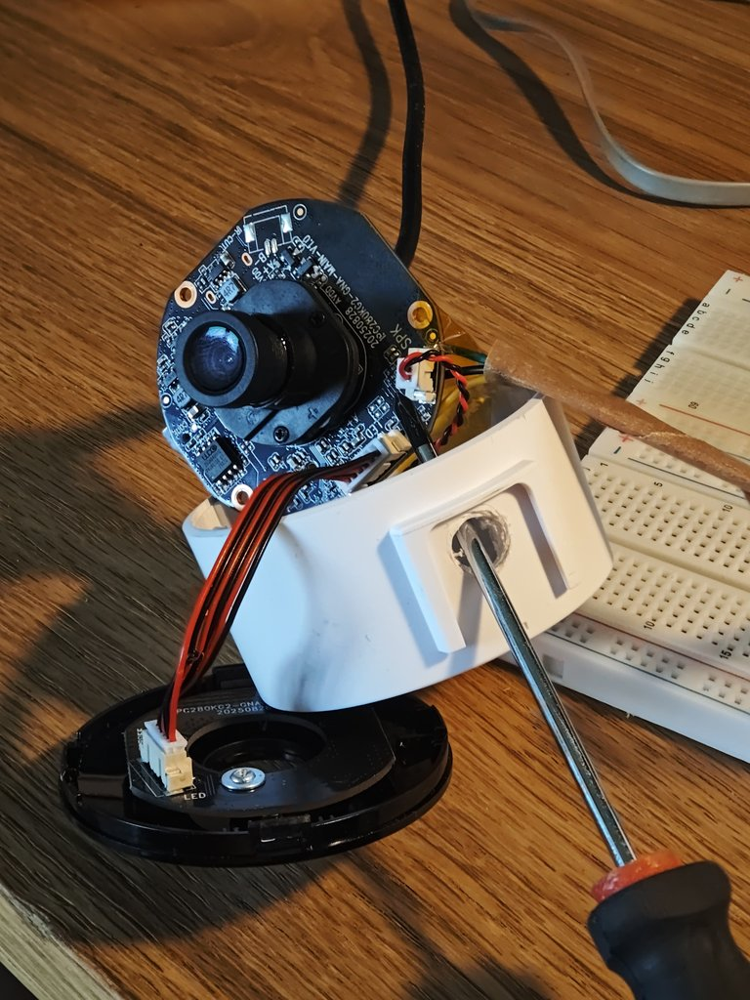 |

---

## 4. UART Serial Connection

The PCB exposes four unpopulated solder test pads right next to the SoC: **TX**, **RX**, **GND**, and **3V3** (not required).

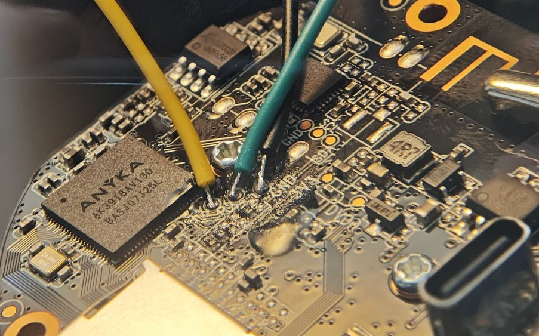
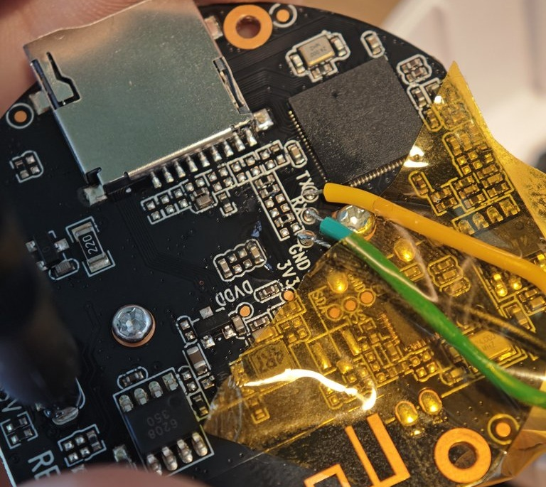

### Pinout & Parameters
- **Baud Rate:** `115200`
- **Data Bits:** `8`
- **Parity:** `None`
- **Stop Bits:** `1`
- **Flow Control:** `None`
- **Logic Level:** `3.3V` (Do NOT connect 5V UART adapters!)

> 💡 **TIP:** Use 28–30 AWG enamel or silicone hookup wire. Secure the solder joints with Kapton tape to prevent pad tear-out when routing wires outside the camera housing.

---

## 5. Automated U-Boot Interception & Bridge

The camera's U-Boot bootloader has a very narrow interrupt window (~1 second) during power-up.
In practice, hitting Ctrl+C by hand at the right moment — over a plain terminal, watching for
the banner yourself — is unreliable; you will likely miss it more often than not. This project's
own sessions have all relied on the ESP32 bridge below to actually catch this window.

### ESP32 UART Bridge (`tools/hardware_debug/lolin32_uart_bridge`) — required for reliable interception
An ESP32 (such as a WEMOS LOLIN32) can be placed between your PC and the camera:

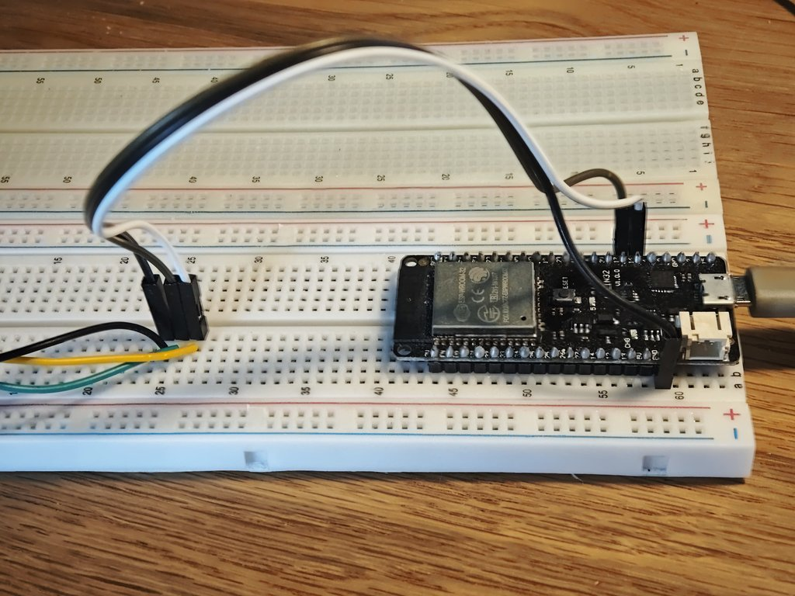

**Wiring:**
| ESP32 | Camera |
|---|---|
| GPIO16 (RX1) | Camera TX |
| GPIO17 (TX1) | Camera RX |
| GND | Camera GND |

The firmware listens for the `"U-Boot"` banner in the serial stream and immediately transmits a
burst of `Ctrl+C` characters (15x at 80ms intervals) to stop autoboot reliably. This is the piece
that actually makes the ~1 second window catchable — without it, plan on a lot of failed power
cycles.

### WinUI Serial Console (`tools/hardware_debug/serial_console_dotnet`)
A custom Windows .NET 9 WinUI application designed for high-baud log streaming, automated base64
file transfer over serial, and automating the 4-step bootargs/`bootm` sequence once you're
already sitting at the U-Boot prompt (see §6 below). It does **not** currently do its own
automatic interrupt-the-boot-banner detection the way the ESP32 bridge does — you'd still need
the ESP32 bridge (or very fast reflexes and a lot of luck) to actually stop autoboot in the first
place. Adding a "spam Ctrl+C the instant the port opens" button to this app is a plausible
improvement (the terminal already has full keystroke-injection plumbing for this), but it hasn't
been built or tested — treat it as an idea for anyone who wants to try it, not a supported
feature.

---

## 6. Dropping into a U-Boot Root Shell

If you need a recovery root shell without knowing any passwords:

1. Interrupt U-Boot to reach the `AK3918AV130 #` prompt.
2. Run:
   ```sh
   setenv bootargs console=ttySAK0,115200n8 root=/dev/mtdblock5 rootfstype=squashfs init=/bin/sh ${mtdparts} ${mem} ${memsize}
   run read_kernel
   run read_dtb
   bootm 0x80008000 - 0x81300000
   ```
3. Once the root `#` prompt appears, mount essential filesystems:
   ```sh
   mount -t proc proc /proc
   mount -t sysfs sysfs /sys
   mount -t jffs2 /dev/mtdblock6 /etc/config
   ```
